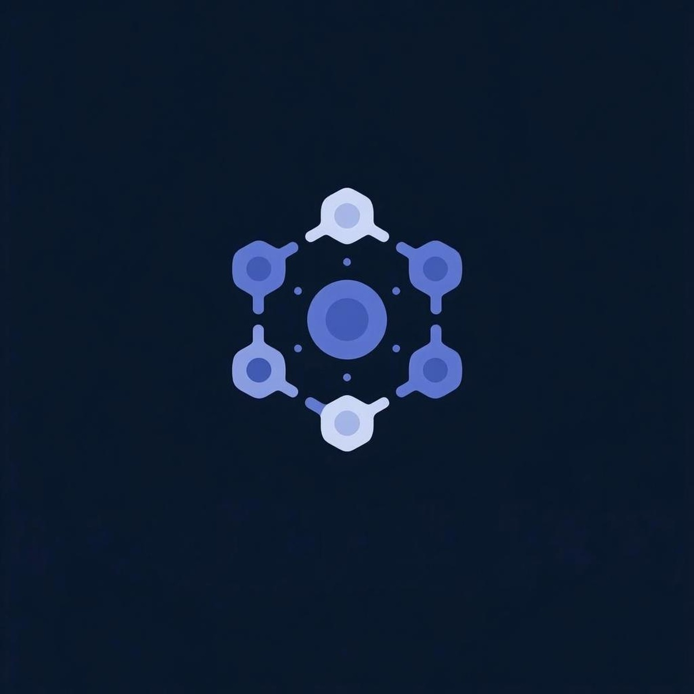

# O.L.T.R.A

**O.L.T.R.A (One Launcher to Rule Them All)** is a modern, reliable meta-launcher platform that allows gamers to access all game and content from a single centralized application.

---

## 🎯 Mission

The mission of O.L.T.R.A is to:

- Eliminate the need for users to install multiple launchers for different games.  
- Allow game publishers to fully control their brand, store, and data through an integrated SDK.  
- Provide an open-source, trustworthy, and professional platform for both communities and publishers.  
- Deliver a modern, clean, and user-friendly experience for accessing games.

## 🛠 Features (MVP)

- **Modular SDK**: Publishers can integrate their own UI, store, friends, and game management modules.  
- **Centralized Launcher**: Access all games from a single application.  
- **Bootstrapper-Based Game Launching**: Anti-cheat, DRM, and game start processes are handled by publisher-provided bootstrappers.  
- **Open Source**: Fully transparent, secure, and community-auditable.  
- **Platform-Agnostic**: Flexible architecture for Windows, Linux, and macOS (MVP focuses on Windows support).
